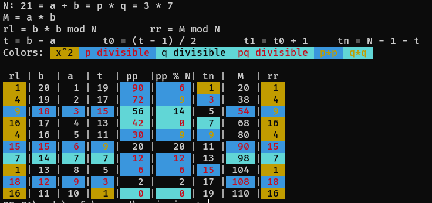

# Semiprimes 
look up into semiprimes.
based upon [this](https://habr.com/en/articles/880142/) article.

renders some insights of numeric sequences related to provided semiprime



# Installation

```sh
cargo install --git https://github.com/non-descriptive/semiprimes
```

# Usage

```sh
./semiprimes 21
```

you can limit output by providing -m or -maxlines

```sh
./semiprimes 407 -m 20 # will output 20 lines
```

Also you can choose range of rows to output. Basically column a is your column number starting from 1.
With `maxlines` provided will limit output within this range, not from the beginning.

```sh
./semiprimes 407 -r 20 50
```